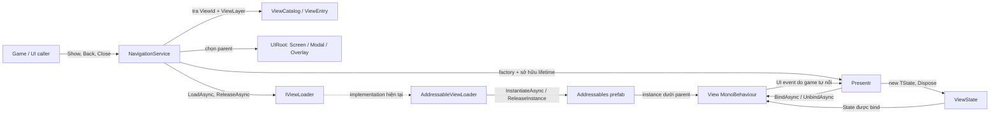
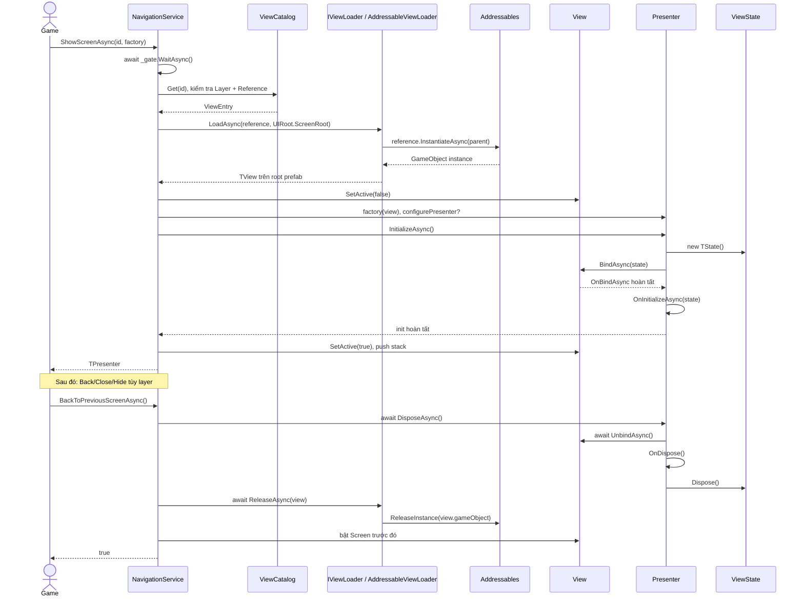
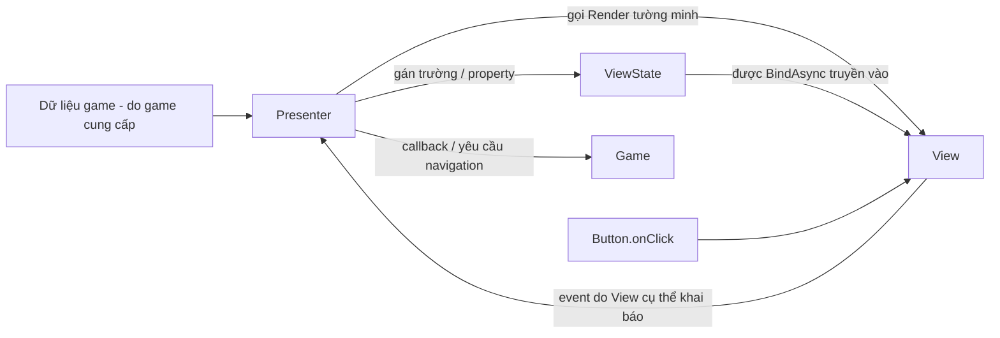

# Hiểu kiến trúc và vòng đời UI của MXEngine


## 1. MXEngine là gì?

Phần MXEngine hiện có là một bộ khung nhỏ để mở, xếp lớp và đóng **UI prefab** trong Unity. Nó gom việc chọn prefab, instantiate qua Addressables, tạo Presenter, bind State và giải phóng instance vào một luồng nhất quán. Nó chưa phải game engine đầy đủ, hệ thống UI có data binding tự động, hay bộ định tuyến mọi scene.

Nếu mỗi nút trong game tự `Instantiate` prefab, tự lưu màn hình cũ và tự `Destroy`, logic điều hướng, xử lý sự kiện và giải phóng Addressables dễ bị rải khắp các `MonoBehaviour`. Ở đây game gọi `NavigationService`; service giữ lifetime của từng View/Presenter. `View` vẫn là component Unity để nắm `Button`, `Text`, `GameObject`; Presenter là C# object điều khiển nó; `ViewState` là dữ liệu UI thuộc lần mở đó.

MVP ở đây có nghĩa **View + State + Presenter**, không phải một kiến trúc domain Model hoàn chỉnh. `ViewState` chỉ có cơ chế `Dispose`, chưa có property change notification hay persistence. [Source: `ViewState`](../Assets/MXEngine/MVP/ViewState.cs), [`View`](../Assets/MXEngine/MVP/View.cs), [`Presentr`](../Assets/MXEngine/MVP/Presenter.cs).

## 2. Kiến trúc tổng thể



Mũi tên trong đề bài `View → ViewState → Presenter → NavigationService → ViewLoader → Addressables → UIRoot` nên được hiểu là **quan hệ**, không phải thứ tự thực thi. Khi mở, lệnh đi từ game vào `NavigationService`, qua catalog/loader để có View, rồi mới tạo Presenter/State và bind. Khi tương tác, event có thể đi từ View về Presenter nếu game tự đăng ký. [`NavigationService`](../Assets/MXEngine/NavigationService.cs) là nơi nối các thành phần.

| Thành phần | Trách nhiệm trong code hiện tại |
| --- | --- |
| `ViewId` | Khóa enum để yêu cầu một UI (`Lobby`, `Gameplay`, `Settings`, `Loading`...). |
| `ViewEntry` / `ViewCatalog` | Ánh xạ ID → `AssetReferenceGameObject` + `ViewLayer`; `Get` tìm entry đầu tiên cùng ID. |
| `UIRoot` | Ba `Transform` do scene gán để làm parent cho Screen, Modal, Overlay. Bản thân nó không điều hướng. |
| `IViewLoader` | Hợp đồng load component từ asset reference và release component đó. |
| `AddressableViewLoader` | Hiện thực Instantiate/Release bằng Addressables. |
| `NavigationService` | Kiểm tra catalog/layer, sắp xếp screen/modal/overlay, tuần tự hóa request, sở hữu Presenter và gọi cleanup. |
| `Presentr` | Tạo State, bind View, chạy hook khởi tạo; khi dispose thì unbind View và dispose State. |
| `View<TState>` | Giữ tham chiếu State trong thời gian bind, gọi hook để UI cụ thể tự hiển thị/dỡ sự kiện. |

## 3. Cấu trúc thư mục cần đọc

```text
Assets/MXEngine/
  MVP/
    ViewState.cs, View.cs, Presenter.cs
    ScreenPresenter.cs, ModalPresenter.cs
    ViewId.cs, ViewEntry.cs, ViewCatalog.cs
    IViewLoader.cs, AddressableViewLoader.cs
  UIRoot.cs
  NavigationService.cs
  Samples/NavigationDemo/
    NavigationDemo.cs, NavigationDemoView.cs
    NavigationDemoCatalog.asset, Prefabs/
    Editor/NavigationDemoBuilder.cs
Assets/Scenes/NavigationDemo.unity
Assets/AddressableAssetsData/
Packages/manifest.json
```

`MVP/` là lõi UI. `NavigationService.cs` và `UIRoot.cs` đặt ngoài namespace `MXEngine.MVP` nhưng sử dụng các type trong đó. `Samples/NavigationDemo` là ví dụ: [`NavigationDemo.cs`](../Assets/MXEngine/Samples/NavigationDemo/NavigationDemo.cs) tạo service trong `Awake`, gọi API từ button; [builder](../Assets/MXEngine/Samples/NavigationDemo/Editor/NavigationDemoBuilder.cs) tạo scene, prefab, catalog và đăng ký prefab thành Addressable. Sample này minh họa navigation, chưa minh họa cập nhật State hoặc business logic. `Assets/AddressableAssetsData` chứa cấu hình Addressables của sample. `Assets/Scenes/SampleScene.unity`, URP settings và các package NuGet đi kèm không tạo thêm tầng kiến trúc cho MXEngine UI.

## 4. MVP được áp dụng ra sao?

### State / Model

`ViewState : IDisposable` chỉ có `Dispose()` và hook `OnDispose()`. Mỗi `Presentr<TView,TState>.InitializeAsync()` gọi `new TState()`; vì vậy State phải có constructor không tham số. Dữ liệu domain (save game, inventory, network...) không có interface hay storage riêng trong MXEngine. Muốn hiển thị dữ liệu đó, game đưa dependency cho Presenter, rồi Presenter chép dữ liệu cần hiển thị vào State.

### View

`View<TState> : MonoBehaviour` giữ `State` với `private set`. `BindAsync(state)` gán `State` **trước** khi gọi `OnBindAsync(state)`. `UnbindAsync()` gọi `OnUnbindAsync` rồi xóa `State` trong `finally`, kể cả hook ném exception. View cụ thể tự quyết định đọc State, thay `Text`, đăng ký/gỡ `Button.onClick`; base class không tự đồng bộ UI khi property của State đổi.

### Presenter

`Presentr<TView,TState>` là C# class thường. Nó giữ `View`, tạo và giữ `State`, gọi bind, sau đó gọi `OnInitializeAsync(state)`. `OnDispose()` là hook đồng bộ để Presenter tự bỏ đăng ký sự kiện hoặc giải phóng tài nguyên riêng. `ScreenPresenter` và `ModalPresenter` hiện chỉ kế thừa `Presentr`, **không thêm hành vi**; generic constraint ở `ShowScreenAsync`/`ShowModalAsync` dùng chúng để phân loại API. Overlay có Presenter dùng thẳng `Presentr`; không có `OverlayPresenter` riêng. [Source: `ScreenPresenter`](../Assets/MXEngine/MVP/ScreenPresenter.cs), [`ModalPresenter`](../Assets/MXEngine/MVP/ModalPresenter.cs).

```csharp
public class Presentr<TView, TState> : IDisposable
    where TView : View<TState>
    where TState : ViewState, new()
```

`TView : View<TState>` bảo đảm View nhận đúng loại State. `TState : ViewState, new()` bảo đảm có thể `new TState()` và dispose nó. Giá phải trả là không truyền constructor argument trực tiếp vào State. Chữ `Presentr` thiếu `e` là typo API hiện tại, không phải tên viết tắt của một type khác.

## 5. Vòng đời một View: từ mở đến giải phóng

Ví dụ mở Screen mới với `stack: true` và chưa có cùng `ViewId` trong stack:

1. Game gọi `ShowScreenAsync<TPresenter,TView,TState>(id, factory, ...)`; service lấy `_gate`.
2. `CreateAsync` kiểm tra factory, `ScreenRoot`, rồi `GetEntry`: phải có entry, layer là `Screen`, reference hợp lệ.
3. `_loader.LoadAsync<TView>(reference, ScreenRoot)` chạy `AssetReferenceGameObject.InstantiateAsync(parent)` và lấy component `TView` trên **root GameObject** của prefab.
4. Service `SetActive(false)` cho instance vừa load; factory tạo Presenter từ View; `configurePresenter` (nếu có) chạy trước khi init.
5. `Presenter.InitializeAsync()` tạo `TState`, gán `State`, gọi `View.BindAsync(state)`, rồi `Presenter.OnInitializeAsync(state)`.
6. Service ẩn Screen cũ (nếu có), bật Screen mới, đưa `OpenView` vào `_screens` và trả Presenter. Screen cũ vẫn sống, chỉ inactive.

Khi `BackToPreviousScreenAsync` có ít nhất hai Screen: service pop Screen trên cùng; `ReleaseAsync` **await** Presenter `DisposeAsync()` trước, sau đó **await** loader `ReleaseAsync(view)` trong `finally`; cuối cùng bật lại Screen bên dưới. Bên trong Presenter, dispose đợi quá trình init đang chạy, gọi `View.UnbindAsync()`, chạy `OnDispose()`, rồi `State.Dispose()`. `AddressableViewLoader.ReleaseAsync` gọi `Addressables.ReleaseInstance(view.gameObject)`. Với Screen cuối cùng, `BackToPreviousScreenAsync` trả `false` và không đóng gì. [Source: [`NavigationService`](../Assets/MXEngine/NavigationService.cs), [`Presentr`](../Assets/MXEngine/MVP/Presenter.cs), [`AddressableViewLoader`](../Assets/MXEngine/MVP/AddressableViewLoader.cs)].



**Nhánh lỗi:** Nếu load thất bại, Addressables trả null hoặc prefab không có `TView`, loader release handle hợp lệ rồi ném lỗi. Nếu factory/configure/init lỗi sau khi load, `CreateAsync` dispose Presenter (nếu đã tạo) rồi release View. Nếu release Presenter lỗi khi đóng, `ReleaseAsync` vẫn gọi loader nhờ `finally`. Đây là cleanup có trong source, không có cơ chế tự retry.

## 6. NavigationService: ba loại UI, một cổng điều hướng

`NavigationService` được tạo bằng `(IViewLoader loader, ViewCatalog catalog, UIRoot uiRoot)`; game phải tự tạo và giữ instance, như [`NavigationDemo.Awake`](../Assets/MXEngine/Samples/NavigationDemo/NavigationDemo.cs). Không có singleton hoặc service locator trong source.

| Cấu trúc | Lý do và hành vi thực tế |
| --- | --- |
| `Stack<OpenView> _screens` | Màn hình theo lịch sử. Chỉ top active; Screen dưới vẫn giữ View, State, Presenter. Back pop top rồi bật lại top trước đó. |
| `Stack<OpenView> _screenReorderBuffer` | Buffer tạm khi mở lại một Screen đã có sâu trong stack: đưa chính instance đó lên top mà giữ thứ tự các Screen khác. |
| `Stack<OpenView> _modals` | Modal mới chồng lên modal cũ; `CloseModalAsync` chỉ pop modal trên cùng. Cùng `ViewId` có thể mở nhiều lần. |
| `Dictionary<ViewId,OpenView> _overlays` | Mỗi ID chỉ có một overlay đang mở, có thể hide theo ID; không có thứ tự Back cho overlay. |
| `SemaphoreSlim _gate` | Mọi public navigation operation trong service được chạy tuần tự, kể cả thời gian đang await load/init/release. `IsInTransition` đọc `CurrentCount == 0`. |

| Tình huống | Điều source thực sự làm |
| --- | --- |
| Mở Screen mới, `stack: true` | Load/init mới, ẩn top cũ, push mới. |
| Mở đúng ID của top | Trả Presenter đang sống; không load/bind lại. Nếu yêu cầu type Presenter khác, ném lỗi. |
| Mở ID đã nằm sâu trong stack | Chuyển chính `OpenView` cũ lên top, ẩn top trước đó, bật View cũ; State/Presenter giữ nguyên. |
| Back Screen | Cần ít nhất 2 Screen; dispose/release top rồi bật Screen kế trước; trả `false` nếu không thể back. |
| Mở Modal | Luôn load/init instance mới và push; không tự ẩn Screen hay Modal cũ. |
| Đóng Modal / tất cả Modal | Pop rồi dispose/release top / từng modal; trả `false` nếu stack rỗng. |
| Mở Overlay | API có Presenter dùng `CreateAsync`; overload `ShowOverlayAsync<TView>` chỉ load component, không tạo State/Presenter. Cả hai từ chối ID đã mở. |
| Đóng Overlay | `HideOverlayAsync(id)` xóa khỏi dictionary rồi dispose/release; trả `false` khi không tìm thấy. |
| Replace Screen (`stack: false`) | Load/init Screen mới trước, sau đó pop và release **toàn bộ** Screen cũ, rồi push mới. Modal/Overlay vẫn giữ nguyên. |
| Nhiều request cùng lúc | Request sau đợi `_gate`; thứ tự thực thi theo lần lấy semaphore. Service không gom trùng request và không có cancellation token. |

`GetEntry` xác nhận `ViewLayer` và `RuntimeKeyIsValid()` trước khi load. Việc layer là `Screen`/`Modal`/`Overlay` được quyết định bởi catalog, không phải tự suy ra từ prefab. `ScreenPresenter`/`ModalPresenter` là ràng buộc type ở API; catalog vẫn được kiểm tra riêng.

## 7. Addressables và ranh giới của loader

`IViewLoader.LoadAsync<T>(AssetReferenceGameObject reference, Transform parent)` trả một `Component` của prefab đã instantiate; `ReleaseAsync(Component)` giải phóng nó. `AddressableViewLoader` triển khai bằng `reference.InstantiateAsync(parent)`, kiểm tra `handle.Status == Succeeded`, `GameObject` và `TryGetComponent<T>`; lỗi thì `Addressables.Release(handle)` nếu handle hợp lệ. Sau khi load thành công, instance sống cho đến khi service gọi `Addressables.ReleaseInstance(view.gameObject)`.

Release là bước cân bằng cho instantiate Addressables: chỉ `SetActive(false)` không giảm reference count hoặc hủy instance. Service luôn cố release View sau khi dispose Presenter. API `ReleaseAsync` hiện trả `UniTask.CompletedTask` vì `ReleaseInstance` là lời gọi đồng bộ trong implementation này.

**Ranh giới phụ thuộc thực tế:** `ViewState`, `View`, `Presentr`, `ScreenPresenter`, `ModalPresenter`, `UIRoot` không gọi Addressables. `NavigationService` chỉ gọi `IViewLoader` để load/release, nhưng vẫn biết `ViewEntry.Reference` và kiểm tra `RuntimeKeyIsValid()`. `IViewLoader` **vẫn dùng type `AssetReferenceGameObject`**, `ViewEntry` và `ViewCatalog` cũng vậy; do đó đây là khả năng thay cách *instantiate/release* để test hoặc thay implementation, chưa phải tách Addressables hoàn toàn khỏi toàn bộ API.

## 8. UniTask và async lifecycle

Các điểm await quan trọng: loader chờ Addressables load; View có `OnBindAsync`/`OnUnbindAsync`; Presenter có `OnInitializeAsync`/`DisposeAsync`; service await từng bước. Hook `OnDispose()` và `ViewState.OnDispose()` là **đồng bộ**. Không có `CancellationToken` trong các API này.

`Presentr` dùng hai `UniTaskCompletionSource`:

- `_initializationCompletion` báo khi phần khởi tạo kết thúc, kể cả khi có exception. Lần gọi init thứ hai khi đang init hoặc đã init bị từ chối.
- `_disposeCompletion` làm `DisposeAsync` idempotent: nhiều caller nhận cùng kết quả cleanup. Nó được tạo trước khi cleanup bắt đầu; `_disposed = true` khiến init đang chạy dừng ở lần `ThrowIfDisposed()` kế tiếp.

Nếu `DisposeAsync()` xảy ra lúc `View.BindAsync` hoặc `OnInitializeAsync` còn chạy, `DisposeCoreAsync` đợi `_initializationCompletion.Task`. Sau khi hook hiện tại kết thúc, `InitializeAsync` phát hiện disposed, nhảy vào nhánh lỗi và gọi `DisposeAsync()`; cleanup đã chạy hoặc đang chạy. **State không bị dispose giữa lúc hook init còn dùng nó**. Nếu bind/init thất bại bình thường, `InitializeAsync` cũng tự cleanup trước khi ném lỗi. `NavigationService` tiếp tục await dispose trước khi release prefab.

`IDisposable.Dispose()` của Presenter chỉ gọi `DisposeAsync().Forget()`: caller gọi `Dispose()` không có bảo đảm cleanup đã xong khi hàm trả về. Với View Addressable, dùng `await DisposeAsync()` hoặc để `NavigationService` đóng View. [Source: [`Presentr`](../Assets/MXEngine/MVP/Presenter.cs)].

## 9. Ví dụ dùng trong game: Main Menu

Ví dụ này dùng **API đang có** và `ViewId.Lobby` hiện có. Prefab được đăng ký dưới `Lobby` trong `ViewCatalog` phải có `MainMenuView` trên root; scene phải gán đủ ba root của `UIRoot`. `onStartGame` là callback do game cung cấp, không phải API MXEngine.

```csharp
using System;
using Cysharp.Threading.Tasks;
using MXEngine.MVP;
using UnityEngine;
using UnityEngine.UI;

public sealed class MainMenuState : ViewState
{
    public string Title;
}

public sealed class MainMenuView : View<MainMenuState>
{
    [SerializeField] private Text titleText;
    [SerializeField] private Button startButton;
    public event Action StartClicked;

    protected override UniTask OnBindAsync(MainMenuState state)
    {
        startButton.onClick.AddListener(RaiseStart);
        return UniTask.CompletedTask;
    }

    protected override UniTask OnUnbindAsync(MainMenuState state)
    {
        startButton.onClick.RemoveListener(RaiseStart);
        return UniTask.CompletedTask;
    }

    public void Render(MainMenuState state) => titleText.text = state.Title;
    private void RaiseStart() => StartClicked?.Invoke();
}

public sealed class MainMenuPresenter : ScreenPresenter<MainMenuView, MainMenuState>
{
    private readonly Action _onStartGame;

    public MainMenuPresenter(MainMenuView view, Action onStartGame) : base(view)
        => _onStartGame = onStartGame;

    protected override UniTask OnInitializeAsync(MainMenuState state)
    {
        state.Title = "Main Menu";
        View.Render(state); // State không tự thông báo thay đổi.
        View.StartClicked += OnStartClicked;
        return UniTask.CompletedTask;
    }

    protected override void OnDispose() => View.StartClicked -= OnStartClicked;
    private void OnStartClicked() => _onStartGame?.Invoke();
}
```

Trong một method async của game:

```csharp
var navigation = new NavigationService(
    new AddressableViewLoader(), catalog, uiRoot);

await navigation.ShowScreenAsync<MainMenuPresenter, MainMenuView, MainMenuState>(
    ViewId.Lobby,
    view => new MainMenuPresenter(view, StartGame));

// Sau này, nếu đang có một Screen khác trên Lobby:
await navigation.BackToPreviousScreenAsync();
```

`StartGame` ở đây là method game tự viết. Nếu muốn Screen mới, callback có thể yêu cầu `ShowScreenAsync` từ luồng event UI, nhưng phải xử lý lỗi async ở phía game. Không await một navigation request mới **ngay trong** `OnInitializeAsync` của một request đang mở (xem mục 13).

## 10. Luồng dữ liệu và event



Base `ViewState` không phát `OnChanged`; base `View` không tự render; base Presenter không tự nghe event. Ví dụ trên tự khai báo `StartClicked`, đăng ký ở `OnInitializeAsync`, gỡ ở `OnDispose()`, và gọi `Render(state)` sau khi cập nhật State. Sample [`NavigationDemo`](../Assets/MXEngine/Samples/NavigationDemo/NavigationDemo.cs) còn đơn giản hơn: button ở scene gọi trực tiếp `NavigationService`; `NavigationDemoState` rỗng. Vì thế không nên suy ra MXEngine đã có reactive binding, event bus hoặc command system.

## 11. Dependency nào thực sự được dùng?

Đối chiếu [`Packages/manifest.json`](../Packages/manifest.json) với `using`/API trong `Assets/MXEngine`:

| Nhóm | Package | Chỗ dùng |
| --- | --- | --- |
| Bắt buộc cho lõi hiện tại | `com.cysharp.unitask` (`2.5.11` trong manifest) | `UniTask`, `UniTaskCompletionSource`, async lifecycle của View/Presenter/loader/navigation. |
| Bắt buộc cho loader/catalog hiện tại | `com.unity.addressables` (`2.9.1`) | `AssetReferenceGameObject`, `InstantiateAsync`, `ReleaseInstance`, catalog và kiểm tra reference. |
| Nền Unity của lõi | `UnityEngine`/`MonoBehaviour`/`ScriptableObject`/`Transform` | View, catalog, UIRoot và hierarchy. Đây là nền runtime Unity, không phải một framework MXEngine riêng. |
| Chỉ sample/demo | `com.unity.ugui`, `com.unity.inputsystem` | `Button`, `Text`, `Canvas`, `InputSystemUIInputModule` trong demo/builder. Game dùng UI khác vẫn phải tuân theo `View<TState>` hiện tại. |
| Không thấy lõi MXEngine gọi | URP, 2D packages, Timeline, Visual Scripting, Multiplayer Center, NuGetForUnity, Unity Pipeline, Rider/Visual Studio integration, `com.unity.modules.*` khác | Package của project/editor/template hoặc phục vụ mục đích khác; không phải dependency bắt buộc của luồng UI đang phân tích. |

`Assets/Packages` chứa các DLL/NuGet asset khác, nhưng source MXEngine đang xét không import chúng. "Không thấy dùng trong lõi" chỉ dựa trên code của checkout này, không phủ định game tương lai có thể dùng chúng.

## 12. Các quyết định thiết kế: fact và suy luận

| Code thực sự làm | Suy luận hợp lý về ý đồ (không phải cam kết của tác giả) |
| --- | --- |
| `Presentr` không kế thừa `MonoBehaviour`; factory tạo bằng `new`. | Tách logic điều khiển khỏi GameObject để quản lý lifetime và test dễ hơn. |
| `View<TState>` kế thừa `MonoBehaviour`. | Giữ Inspector reference và lifecycle UI của Unity ngay tại lớp hiển thị. |
| Service nhận `IViewLoader` qua constructor. | Cho phép thay cách load/release hoặc dùng fake loader khi test. Abstraction vẫn lộ `AssetReferenceGameObject`. |
| `NavigationService` lưu `OpenView` và gọi dispose trước release. | Buộc hook dỡ event/tài nguyên hoàn tất trước khi prefab bị hủy. |
| Screen/Modal dùng stack; Overlay dùng dictionary. | Screen/Modal cần hành vi top/Back, Overlay cần truy cập bằng ID. |
| Có `_gate` bọc mọi thao tác. | Tránh hai request cùng sửa các collection/lifetime trong lúc async load/cleanup. |
| View có `OnBindAsync`/`OnUnbindAsync`. | Cho phép View cụ thể cần async setup/teardown; source hiện chưa quy định việc cụ thể phải làm trong hook. |

## 13. Những điểm cần chú ý trong source hiện tại

Đây là nhận xét từ code, **không phải kết quả Play Mode** và không thay đổi source:

1. **Deadlock nếu điều hướng lồng nhau và await:** `Show*Async` giữ `_gate` xuyên suốt `CreateAsync` → `Presenter.OnInitializeAsync`/`View.OnBindAsync`. Nếu một hook này `await` tiếp một lời gọi navigation trên **cùng service**, lời gọi trong sẽ đợi gate; lời gọi ngoài lại đợi hook. Tương tự với hook dispose/unbind khi đóng. Hãy đưa navigation nối tiếp ra ngoài hook hoặc điều phối sau khi request hiện tại trả về.
2. **Prefab có thể hoạt động trước khi service ẩn nó:** loader instantiate prefab trước, `CreateAsync` mới `SetActive(false)`. `Awake`/`OnEnable` của prefab active có thể chạy trước bind; UI có thể lộ thoáng qua. View của game không nên giả định State đã tồn tại ở `Awake`/`OnEnable`.
3. **Service không có `Dispose`/`CloseAllScreens`:** nếu owner bị hủy khi còn Screen/Modal/Overlay, source không tự đi qua `ReleaseAsync` cho các entry còn mở. Sample `NavigationDemo.OnDestroy` chỉ gỡ listener button. Cần quy ước teardown ở game để tránh giữ Addressables instance/reference và Presenter lâu hơn dự kiến.
4. **Lỗi cleanup có thể che lỗi gốc:** khi `InitializeAsync` lỗi rồi `DisposeAsync` cũng lỗi, hoặc `CreateAsync` cleanup lỗi, exception cuối có thể là lỗi cleanup. `ReleaseAsync` vẫn cố release View sau lỗi dispose Presenter.
5. **Replace không rollback toàn bộ lịch sử nếu cleanup lỗi:** `stack: false` pop từng Screen cũ trước khi await release. Nếu một release ném exception, Screen đã pop không được đưa lại; catch chỉ bật top còn lại và release Screen mới.
6. **Không có notification cho State:** đổi property sau bind không làm UI cập nhật tự động; game phải gọi View/render tường minh hoặc tự cài cơ chế trong View cụ thể.
7. **Coupling Addressables vẫn hiện diện:** cả `IViewLoader` và catalog dùng `AssetReferenceGameObject`; thay backend khác đòi hỏi đổi contract/cấu hình, không chỉ thay class loader.
8. **Quy tắc Screen/Modal/Overlay là độc lập:** Back không tự đóng Modal hoặc Overlay; replace Screen cũng không đóng chúng. Cùng ID Modal được phép mở lặp, Overlay thì không.
9. **Không có cancellation:** load/init đang chạy giữ gate; `IsInTransition` chỉ phản ánh gate đang giữ, không trả số request chờ và không hủy request cũ.
10. **Typo/naming:** file `Presenter.cs` định nghĩa `Presentr<...>`; tên thiếu `e` đã là API source. `ViewState` là UI state theo instance, chưa phải toàn bộ "Model" của game.
11. **Prefab cần đúng component trên root:** `TryGetComponent<T>` không tìm trong child. Reference hợp lệ không bảo đảm prefab đúng type; lỗi được phát hiện lúc load.
12. **`ViewState.Dispose()` đặt `_disposed` sau `OnDispose()`:** nếu hook ném exception, lần `Dispose()` sau có thể chạy hook thêm lần nữa. `Presenter.Dispose()` là fire-and-forget; dùng nó trực tiếp rồi release View ngay có thể cắt ngang cleanup async.

## 14. Mental model ngắn

```text
ViewId + ViewCatalog = chọn prefab nào và thuộc lớp UI nào
UIRoot              = đặt instance vào đâu trong Canvas
IViewLoader          = tạo / trả lại instance
NavigationService    = giữ lịch sử và sở hữu vòng đời mỗi lần mở
Presentr             = tạo State, bind View, chạy logic, teardown
ViewState            = dữ liệu UI của lần mở đó, có Dispose
View                 = MonoBehaviour nhìn thấy và nhận event Unity
```

Nhớ chuỗi chính: **Show → catalog → Addressables load → tạo Presenter → `new State` → bind View → init Presenter → active → dispose Presenter → unbind View → dispose State → ReleaseInstance**. Screen bị ẩn khi push Screen khác vẫn giữ nguyên chuỗi sống của nó; chỉ khi pop/replace mới teardown.

## 15. Roadmap đọc source

| Bước | File | Cần hiểu trước khi đi tiếp |
| --- | --- | --- |
| 1 | [`ViewState.cs`](../Assets/MXEngine/MVP/ViewState.cs) | State được tạo mới cho một lần mở và dispose thế nào; chưa có notification. |
| 2 | [`View.cs`](../Assets/MXEngine/MVP/View.cs) | `State` được gán lúc bind, xóa lúc unbind; hook thuộc View cụ thể. |
| 3 | [`Presenter.cs`](../Assets/MXEngine/MVP/Presenter.cs) | Thứ tự new State → bind → init và chiều ngược lại; vai trò hai completion source. |
| 4 | [`ScreenPresenter.cs`](../Assets/MXEngine/MVP/ScreenPresenter.cs), [`ModalPresenter.cs`](../Assets/MXEngine/MVP/ModalPresenter.cs) | Hai class này là type phân loại, chưa có logic riêng. |
| 5 | [`IViewLoader.cs`](../Assets/MXEngine/MVP/IViewLoader.cs), [`AddressableViewLoader.cs`](../Assets/MXEngine/MVP/AddressableViewLoader.cs) | Contract vẫn mang Addressables type; success/failure/release handle. |
| 6 | [`ViewId.cs`](../Assets/MXEngine/MVP/ViewId.cs), [`ViewEntry.cs`](../Assets/MXEngine/MVP/ViewEntry.cs), [`ViewCatalog.cs`](../Assets/MXEngine/MVP/ViewCatalog.cs) | ID, layer, asset reference được chọn/kiểm tra ra sao. |
| 7 | [`UIRoot.cs`](../Assets/MXEngine/UIRoot.cs) | Ba parent cần scene gán; root không tự tạo. |
| 8 | [`NavigationService.cs`](../Assets/MXEngine/NavigationService.cs) | Đọc `CreateAsync`/`ReleaseAsync` trước, rồi từng public API và các collection. |
| 9 | [`NavigationDemo.cs`](../Assets/MXEngine/Samples/NavigationDemo/NavigationDemo.cs), [`NavigationDemoBuilder.cs`](../Assets/MXEngine/Samples/NavigationDemo/Editor/NavigationDemoBuilder.cs) | Xem game tạo service, catalog/prefab/scene được nối, button gọi API thực tế. |

Sau bước 8, hãy tự lần theo hai đường `ShowScreenAsync → CreateAsync → InitializeAsync` và `BackToPreviousScreenAsync → ReleaseAsync → DisposeAsync → ReleaseInstance`. Nếu giải thích được vì sao Screen cũ còn sống sau khi bị ẩn, và vì sao phải await dispose trước release, bạn đã nắm được vòng đời cốt lõi.
