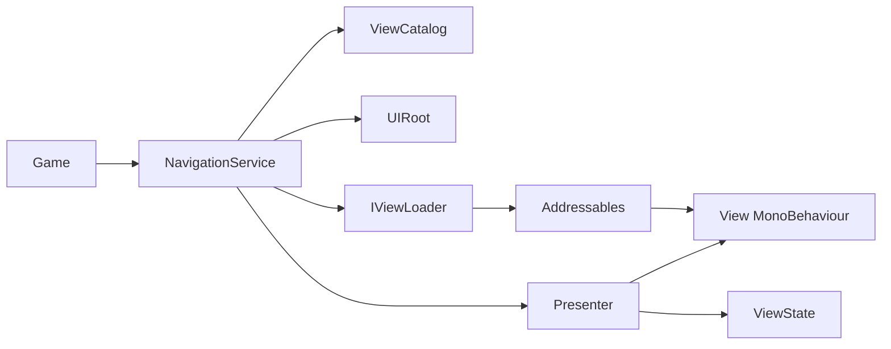

# MXEngine UI

MXEngine quản lý vòng đời UI prefab trong Unity: chọn prefab từ catalog, tạo View qua Addressables, bind State, khởi tạo Presenter, điều hướng Screen/Modal/Overlay và giải phóng instance. Đây là nền UI nhỏ, không chứa dữ liệu gameplay hay hệ thống scene routing.

## Cấu trúc và ranh giới assembly

| Assembly | Nội dung | Phụ thuộc |
| --- | --- | --- |
| `MXEngine` | `NavigationService`, `UIRoot`, MVP, loader, catalog | UniTask, Addressables |
| `MXEngine.Samples` | Demo điều hướng và `GameViewId` | `MXEngine`, uGUI |
| `MXEngine.Samples.Editor` | Builder tạo scene/prefab/catalog | `MXEngine.Samples`, UnityEditor |
| `MXEngine.Tests` | Test lifecycle/navigation với `FakeViewLoader` | `MXEngine`, NUnit |
| `MXEngine.Samples.Tests` | Test ba instance của Settings prefab Addressable | `MXEngine.Samples`, Addressables |

`MXEngine` dùng `int` làm ID. Mỗi game tự định nghĩa hằng số ID; sample đặt chúng trong [GameViewId.cs](Assets/MXEngine/Samples/NavigationDemo/GameViewId.cs). Các giá trị 0–5 của sample được giữ nguyên để catalog hiện có tiếp tục đọc được. `ViewCatalog.Get` báo lỗi nếu trùng ID; mỗi `ViewEntry` chứa ID, `ViewLayer` và `AssetReferenceGameObject`.



Source chính: [NavigationService.cs](Assets/MXEngine/NavigationService.cs), [Presenter.cs](Assets/MXEngine/MVP/Presenter.cs), [View.cs](Assets/MXEngine/MVP/View.cs), [AddressableViewLoader.cs](Assets/MXEngine/MVP/AddressableViewLoader.cs). Demo: [NavigationDemo.cs](Assets/MXEngine/Samples/NavigationDemo/NavigationDemo.cs) và [NavigationDemoBuilder.cs](Assets/MXEngine/Samples/NavigationDemo/Editor/NavigationDemoBuilder.cs).

## Vòng đời khi mở View

1. Game gọi `ShowScreenAsync`, `ShowModalAsync` hoặc `ShowOverlayAsync` với ID, factory Presenter và tùy chọn `CancellationToken`.
2. Service kiểm tra layer/reference trong catalog và chọn `ScreenRoot`, `ModalRoot` hoặc `OverlayRoot` từ `UIRoot`.
3. Loader gọi `Addressables.InstantiateAsync(reference, stage.transform)`. Stage inactive giữ prefab chưa hiển thị trong lúc tải. Mỗi instance có handle riêng trong registry `Component → AsyncOperationHandle<GameObject>`.
4. Loader chuyển instance sang root đang active, bật rồi tắt đồng bộ để Unity chạy `Awake`. `OnEnable` có thể chạy trong bước này trước Bind; View không được đọc `State` trong `OnEnable` nếu chưa kiểm tra null. Không có frame hiển thị được yield ở bước này.
5. Service tạo Presenter; `Presenter.InitializeAsync(token)` tạo `TState`, gọi `View.BindAsync(state, token)`, sau đó `OnInitializeAsync(state, token)`.
6. Sau khi init hoàn tất, service bật View và commit vào stack/dictionary. Thứ tự được bảo đảm là `Awake → Bind → Presenter init → activation cuối`; `OnEnable` có thể chạy sớm ở bước 4.

Prefab cần component `TView` trên **root GameObject**. Các root của `UIRoot` phải được gán và active trong hierarchy. Hook View/Presenter trả `Task` để `ExecutionContext` đi qua các `await`; API công khai vẫn trả `UniTask`. Ví dụ chữ ký:

```csharp
protected override Task OnBindAsync(MyState state, CancellationToken token);
protected override Task OnUnbindAsync(MyState state);
protected override Task OnInitializeAsync(MyState state, CancellationToken token);
```

Khi đóng, service tắt View, `await Presenter.DisposeAsync()`, View unbind, Presenter `OnDispose()`, State `Dispose()`, rồi loader `Addressables.ReleaseInstance(handle)`. Presenter dispose idempotent; khi dispose trong lúc init đang chờ, token init bị hủy và việc giải phóng View đợi hook kết thúc. Hook async phải tôn trọng token; MXEngine không thể giải phóng View an toàn khi hook vẫn đang dùng nó.

Presenter do `NavigationService` trả về thuộc quyền sở hữu của service: caller dùng nó để tương tác, nhưng đóng qua `BackToPreviousScreenAsync`, `CloseModalAsync`, `HideOverlayAsync` hoặc `ShutdownAsync`. Caller không tự `Dispose()` Presenter đó, vì entry trong navigation vẫn có thể đang active. Presenter tự tạo ngoài service có thể dùng `await DisposeAsync()`.

## Điều hướng

| API | Hành vi |
| --- | --- |
| `ShowScreenAsync(..., stack: true)` | Mở Screen mới, ẩn top cũ nhưng giữ View/State/Presenter; cùng ID ở top trả Presenter hiện có; ID nằm sâu được đưa lên top. |
| `BackToPreviousScreenAsync` | Cần ít nhất hai Screen; pop/release top rồi bật Screen trước. |
| `ShowScreenAsync(..., stack: false)` | Tạo Screen mới trước; khi commit xong, dọn toàn bộ Screen cũ. Modal/Overlay vẫn tồn tại. |
| `ShowModalAsync` | Mỗi lần gọi tạo instance mới, kể cả cùng ID. `CloseModalAsync` pop top; `CloseAllModalsAsync` dọn hết. |
| `ShowOverlayAsync` | Mỗi ID chỉ có một Overlay; có overload với hoặc không có Presenter. `HideOverlayAsync(id)` đóng. |
| `ShutdownAsync` | Ngừng nhận request, hủy request đang chờ và dọn Screen/Modal/Overlay do service sở hữu. Gọi khi owner bị hủy. |

Screen/Modal dùng `_gate`; Overlay dùng `_overlayGate`. Request bên ngoài đến trong lúc Presenter đang `await` được chờ semaphore. Nếu View/Presenter lifecycle callback gọi ngược navigation cùng lúc, `LifecycleContext` ném `InvalidOperationException` ngay để tránh deadlock. Để điều hướng tiếp, phát lệnh từ UI event sau khi hook đã hoàn tất.

`CancellationToken` đi qua gate, loader, View Bind và Presenter Initialize. Hủy trong lúc tải khiến caller ngừng chờ; Addressables có thể tiếp tục tải vật lý. Loader giữ handle cho đến khi operation kết thúc rồi release kết quả. Hủy trước commit làm View mới được dọn và Screen cũ được bật lại. Sau commit, cleanup tiếp tục kể cả caller hủy token.

## Lỗi và quyền sở hữu resource

- Nếu instantiate thất bại, loader release handle. Nếu instance đã được tạo nhưng load bị hủy hoặc thiếu component, loader dùng `ReleaseInstance(handle)` khi operation kết thúc.
- Loader chỉ xóa `Component → handle` sau khi `ReleaseInstance(handle)` thành công. `PendingCleanupCount` và `RetryPendingCleanup()` cho phép kiểm tra/thử lại các operation load bị bỏ dở.
- Navigation giữ View chưa release được trong `PendingReleaseCount`; gọi `RetryPendingReleasesAsync()` sau khi sửa nguyên nhân. Ngay cả khi Presenter dispose lỗi, service vẫn thử release View.
- Sau khi Screen mới đã commit, lỗi dọn Screen cũ được gửi qua event `CleanupFailed` và không làm `ShowScreenAsync` báo thất bại. Back/Close/Hide dùng cùng nguyên tắc sau khi thay đổi state. Lỗi cleanup trong `ShutdownAsync` được gom vào `AggregateException` và các View release lỗi vẫn có thể thử lại.
- Nếu khởi tạo và cleanup cùng lỗi, exception chứa cả hai nguyên nhân qua `AggregateException`.

## Ví dụ nhỏ

```csharp
using System.Threading;
using System.Threading.Tasks;
using MXEngine;
using MXEngine.MVP;
using UnityEngine;
using UnityEngine.UI;

public sealed class MenuState : ViewState { public string Title; }

public sealed class MenuView : View<MenuState>
{
    private Text _title;
    private void Awake() => _title = GetComponent<Text>();
    public void Render(MenuState state) => _title.text = state.Title;
    protected override Task OnBindAsync(MenuState state, CancellationToken token)
    {
        Render(state);
        return Task.CompletedTask;
    }
}

public sealed class MenuPresenter : ScreenPresenter<MenuView, MenuState>
{
    public MenuPresenter(MenuView view) : base(view) { }
    protected override Task OnInitializeAsync(MenuState state, CancellationToken token)
    {
        state.Title = "Menu";
        View.Render(state);
        return Task.CompletedTask;
    }
}

// ID do game định nghĩa. Catalog cần entry ID này với layer Screen.
const int MenuId = 10;
await navigation.ShowScreenAsync<MenuPresenter, MenuView, MenuState>(
    MenuId, view => new MenuPresenter(view), cancellationToken: token);
```

`OnBindAsync` chạy trước `OnInitializeAsync`, nên Presenter gọi `View.Render(state)` sau khi cập nhật `Title`. `ViewState` không tự phát sự kiện khi field đổi.

## Test và giới hạn

[TestSupport.cs](Assets/MXEngine/Tests/TestSupport.cs) dùng `FakeViewLoader`; các test lifecycle, navigation, concurrency, cancellation và failure recovery nằm trong `Assets/MXEngine/Tests/`. Test Addressables thật của cùng một Settings prefab nằm ở [AddressablesIntegrationTests.cs](Assets/MXEngine/Samples/NavigationDemo/Tests/AddressablesIntegrationTests.cs). Chạy test trong Unity Test Runner ở Play Mode. Việc source biên dịch thành công không chứng minh test hoặc demo Play Mode đã chạy thành công.

MXEngine hiện vẫn gắn với `AssetReferenceGameObject` ở loader/catalog và dùng `int` ID không có type safety mạnh. Nó không có reactive binding, DI container, transition, pooling hoặc scene router. `IDisposable.Dispose()` của Presenter là fire and forget; nơi sở hữu Addressable View nên gọi `await DisposeAsync()` hoặc để `NavigationService` quản lý.
